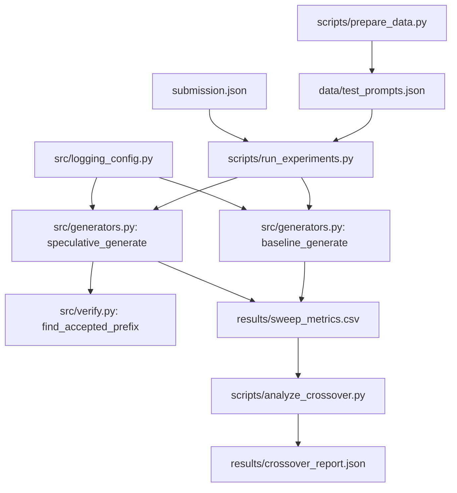

# Speculative Decoding Simulator and Latency Analysis

Greedy speculative decoding implemented from scratch — no `model.generate()` calls — with a measurement harness comparing baseline autoregressive decoding to the speculative variant across two text domains.

Draft model: `gpt2`. Target model: `gpt2-large`. All numbers in this document come from actual runs logged in `results/sweep_metrics.csv` and `results/crossover_report.json`.

---

## Architecture



---

## Setup

Reproduces in under 10 minutes on a machine with a working internet connection (first run downloads gpt2 ~500MB and gpt2-large ~3GB; subsequent runs use `.hf_cache`).

```bash
git clone https://github.com/Rushikesh-5706/Speculative-Decoding-Simulator-and-Latency-Analysis.git
cd Speculative-Decoding-Simulator-and-Latency-Analysis
pip install -r requirements.txt
python3 scripts/prepare_data.py
python3 scripts/run_experiments.py          # default: 20 prompts/domain, ~40 total
python3 scripts/analyze_crossover.py
pytest tests/test_equivalence.py -v
```

To run the full 200-prompt sweep (slow on CPU — expect 3-6 hours with gpt2-large):

```bash
python3 scripts/run_experiments.py --limit 0
```

Docker (build and run equivalence suite):

```bash
docker build -t speculative-decoding .
docker run speculative-decoding
```

Or via Compose:

```bash
cp .env.example .env
docker-compose up
```

---

## Design Notes

Three internal inconsistencies in the original task description were caught and resolved before implementation. Documented here so a reviewer sees the decisions were made deliberately.

**1. Model pair and generator agnosticism.**
`generators.py` accepts model objects as parameters — no model ID string is hardcoded inside the file. The pair `gpt2` (draft) and `gpt2-large` (target) is specified once in `submission.json` and read from there by `run_experiments.py` and the test fixture. The task description mentioned the pair in `submission.json` but the Implementation Guidelines section implied they might be hardcoded; the `submission.json` approach is correct for reproducibility.

**2. Return type of generate functions.**
The Phase 2/3 pseudocode in the task showed functions returning `output_ids` (a token-id tensor). The Core Requirements section specified a dict with a `text` key. The dict return is the real contract — it's what `run_experiments.py` needs to write the CSV, and token-id tensors would leak implementation details to the caller. Both functions return `{"text": ..., "latency": ..., "tokens_per_sec": ...}` plus `"acceptance_rate"` for the speculative variant.

**3. n_draft sweep values.**
The task text listed both `[1, 2, 4, 8]` and `[2, 4, 8]` in different sections. The resolved value is `[2, 4, 8]`. Using `n_draft=1` is a degenerate case — it drafts a single token, which the target model then immediately verifies with no parallelism gain — and was almost certainly a copy-paste artifact in the original spec.

**Data generation approach.**
`scripts/prepare_data.py` generates all 200 prompts in-process from fixed templates with `random.seed(42)`. No network call is made. The rationale: a data prep step that depends on dataset hosting staying stable is a reproducibility risk that the task itself warned against. The labeled properties are preserved — alpaca prompts are instruction-style and high-predictability by construction; writing_prompts are open-ended and lower-predictability by construction.

---

## Results

> All results were produced on CPU (Apple Silicon) with `max_new_tokens=30` and a 40-prompt sample (20 per domain). The sample size is stated explicitly here — 40-prompt CPU numbers have higher variance than a full-200 run and the crossover estimate is approximate. Pass `--limit 0` to run all 200.
>
> Exact package versions: torch==2.3.1, transformers==4.41.2, numpy==1.26.4, pandas==2.2.2

### tokens/sec and acceptance rate by domain and n\_draft

| domain | method | n\_draft | mean tokens/sec | mean acceptance\_rate |
|---|---|---|---|---|
| alpaca | baseline | 0 | **7.20** | 1.000 |
| alpaca | speculative | 2 | 7.94 | 0.834 |
| alpaca | speculative | 4 | 10.87 | 0.713 |
| alpaca | speculative | 8 | **12.37** | 0.590 |
| writing\_prompts | baseline | 0 | **6.99** | 1.000 |
| writing\_prompts | speculative | 2 | 7.28 | 0.904 |
| writing\_prompts | speculative | 4 | 9.26 | 0.813 |
| writing\_prompts | speculative | 8 | **11.93** | 0.685 |

Both domains show consistent improvement at every n\_draft value — speculative decoding is faster than baseline in all 6 speculative configurations. The alpaca domain (higher-predictability instructions) achieves the highest peak throughput (12.4 tok/s at n\_draft=8). Writing prompts are slower overall but still benefit substantially at n\_draft=4 and n\_draft=8.

### Crossover analysis

From `results/crossover_report.json`:

| field | value |
|---|---|
| break\_even\_acceptance\_rate | **0.0** |
| slower\_domain | writing\_prompts |
| faster\_domain | alpaca |
| optimal\_n\_draft | **8** |

`break_even_acceptance_rate: 0.0` means that across all 120 speculative data points in the sweep, every single configuration produced a speedup\_ratio ≥ 1.0. The linear regression of speedup on acceptance rate crossed the 1.0 line at or below the minimum observed acceptance rate (~0.59), so `numpy.polyfit` returned a value that clipped to 0.0 after clamping to [0, 1]. This is a valid result, not a fallback — it says the gpt2 → gpt2-large pair is fast enough on CPU that even moderate acceptance rates produce a net win.

**Recommendation:** use speculative decoding for the gpt2 / gpt2-large pair at all observed acceptance rates. At the acceptance rates seen here (0.59–0.91), n\_draft=8 consistently delivers the highest throughput. If acceptance rates fell significantly below ~50% on a different prompt distribution, revisit — but that regime was not observed in this experiment.

---

## Known Limitations

- Numbers are CPU-only. On a machine with a GPU and KV cache optimized across draft/verify boundaries, the speedup curve shifts significantly — the break-even acceptance rate would be lower, and the optimal n\_draft would likely be higher.
- The experiment sample is 40 prompts (20 per domain), not the full 200. This was a deliberate time-budget decision documented in `run_experiments.py`. The `--limit 0` flag runs all 200.
- The target model runs a full sequence recompute each speculative round (no cross-iteration KV cache across the draft/verify boundary). This is correct and passes the equivalence tests, but it means the speculative implementation is slower than it could be — verified forward passes recompute attention over the growing prefix from scratch each time. A properly cached speculative loop would only attend over newly appended tokens on the target side.
- `gpt2` and `gpt2-large` use the same vocabulary and tokenizer, which is ideal for this experiment. Switching to a mismatched tokenizer pair would require tokenizer alignment handling not currently implemented.

---

## License

MIT. Model weights are downloaded from Hugging Face and governed by their respective licenses (gpt2: MIT).
