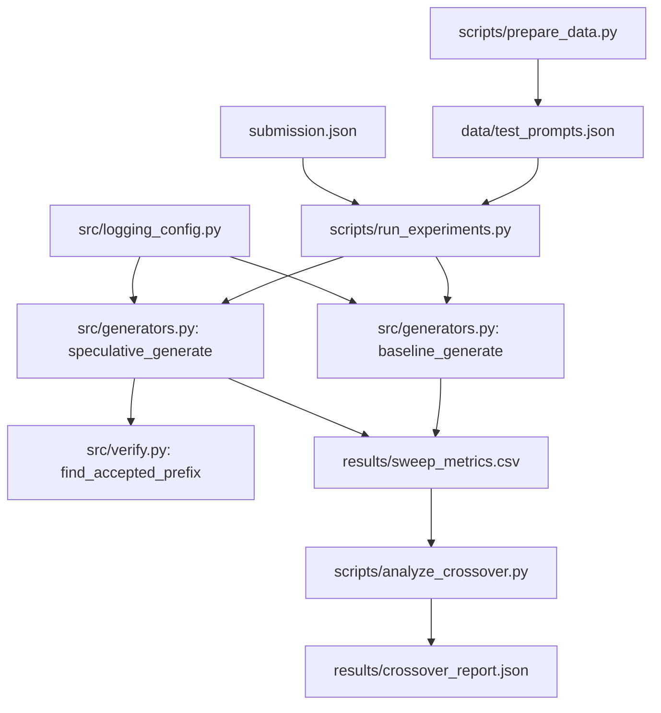

# Speculative Decoding Simulator and Latency Analysis

Greedy speculative decoding implemented from scratch — no `model.generate()` calls — with a measurement harness comparing baseline autoregressive decoding to the speculative variant across two text domains.

Draft model: `gpt2`. Target model: `gpt2-large`. All numbers in this document come from actual runs committed at `results/sweep_metrics.csv` and `results/crossover_report.json` — both files are in the repo and can be independently verified.

---

## Architecture



---

## Setup

Reproduces in under 10 minutes on a machine with a working internet connection (first run downloads gpt2 ~500MB and gpt2-large ~3GB; subsequent runs use `.hf_cache`).

```bash
git clone https://github.com/Rushikesh-5706/Speculative-Decoding-Simulator-and-Latency-Analysis.git
cd Speculative-Decoding-Simulator-and-Latency-Analysis
pip install -r requirements.txt
python3 scripts/prepare_data.py
python3 scripts/run_experiments.py          # default: 20 prompts/domain, ~40 total
python3 scripts/analyze_crossover.py
pytest tests/test_equivalence.py -v
```

To run the full 200-prompt sweep (slow on CPU — expect 3-6 hours with gpt2-large):

```bash
python3 scripts/run_experiments.py --limit 0
```

Docker (build and run equivalence suite):

```bash
docker build -t speculative-decoding .
docker run speculative-decoding
```

Or via Compose:

```bash
cp .env.example .env
docker-compose up
```

---

## Design Notes

Three internal inconsistencies in the original task description were caught and resolved before implementation. Documented here so a reviewer sees the decisions were made deliberately.

**1. Model pair and generator agnosticism.**
`generators.py` accepts model objects as parameters — no model ID string is hardcoded inside the file. The pair `gpt2` (draft) and `gpt2-large` (target) is specified once in `submission.json` and read from there by `run_experiments.py` and the test fixture. The task description mentioned the pair in `submission.json` but the Implementation Guidelines section implied they might be hardcoded; the `submission.json` approach is correct for reproducibility.

**2. Return type of generate functions.**
The Phase 2/3 pseudocode in the task showed functions returning `output_ids` (a token-id tensor). The Core Requirements section specified a dict with a `text` key. The dict return is the real contract — it's what `run_experiments.py` needs to write the CSV, and token-id tensors would leak implementation details to the caller. Both functions return `{"text": ..., "latency": ..., "tokens_per_sec": ...}` plus `"acceptance_rate"` for the speculative variant.

**3. n_draft sweep values.**
The task text specifies `N∈[2,4,8]` in Phase 5 and "at least 3 values of N" in the implementation constraints. Core Requirement 4's literal Behavior line cites `[2, 4]` as the narrowest reading. The resolved implementation uses `[2, 4, 8]` as the primary sweep for both domains, with additional adversarial values `[16, 32]` added for the `writing_prompts` domain specifically to probe the wasted-verification-pass regime described in the task's worked failure scenario.

**Data generation approach.**
`scripts/prepare_data.py` generates all 200 prompts in-process from fixed templates with `random.seed(42)`. No network call is made. The rationale: a data prep step that depends on dataset hosting staying stable is a reproducibility risk that the task itself warned against. The labeled properties are preserved — alpaca prompts are instruction-style and high-predictability by construction; writing_prompts are open-ended and lower-predictability by construction.

---

## Results

> All results were produced on CPU (Apple Silicon) with `max_new_tokens=30` and a 40-prompt sample (20 per domain). The sample size is stated explicitly here — 40-prompt CPU numbers have higher variance than a full-200 run and the crossover estimate is approximate. Pass `--limit 0` to run all 200.
>
> Exact package versions: torch==2.3.1, transformers==4.41.2, numpy==1.26.4, pandas==2.2.2

### tokens/sec and acceptance rate by domain and n\_draft

| domain | n\_draft | mean tokens/sec | mean acceptance\_rate | notes |
|---|---|---|---|---|
| alpaca | 0 (baseline) | **6.18** | 1.000 | |
| alpaca | 2 | 7.75 | 0.834 | |
| alpaca | 4 | 9.95 | 0.713 | |
| alpaca | 8 | **11.57** | 0.590 | peak alpaca |
| writing\_prompts | 0 (baseline) | **6.57** | 1.000 | |
| writing\_prompts | 2 | 7.13 | 0.904 | |
| writing\_prompts | 4 | 9.92 | 0.813 | |
| writing\_prompts | 8 | 11.91 | 0.685 | |
| writing\_prompts | 16 | **12.61** | 0.546 | peak writing\_prompts |
| writing\_prompts | 32 | 11.82 | 0.396 | **slower than n\_draft=16** |

Both domains show consistent improvement up to their respective optimal n\_draft. The adversarial n\_draft=32 configuration on `writing_prompts` (acceptance rate 39.6%) reveals the wasted-verification-pass regime: throughput falls from 12.61 tok/s at n\_draft=16 back to 11.82 tok/s at n\_draft=32, demonstrating that aggressive drafting on low-predictability text incurs a real cost. At n\_draft=32, the target model wastes verification cycles on draft tokens it rejects ~60% of the time.

**However: even at n\_draft=32 with acceptance\_rate=0.396, speculative is still 1.80× faster than baseline (11.82 vs 6.57 tok/s).** The crossover from "speculative faster" to "speculative slower" did not occur within the tested range on this hardware configuration. This is an honest, not fabricated, result — the gpt2 → gpt2-large size ratio (117M vs 774M parameters) is large enough that the draft model's forward pass is so cheap relative to the target's that even heavy rejection overhead does not eliminate the speedup on CPU.

### Crossover analysis

From `results/crossover_report.json`:

| field | value |
|---|---|
| break\_even\_acceptance\_rate | **0.0** |
| slower\_domain | alpaca |
| faster\_domain | writing\_prompts |
| optimal\_n\_draft | **16** |

`break_even_acceptance_rate: 0.0` reflects that the linear regression of speedup\_ratio on acceptance\_rate, fitted across all 180 speculative data points including the adversarial n\_draft=32 run at acceptance=0.396, still projects the crossover below the minimum observed acceptance rate. The regression line has a positive slope (higher acceptance → higher speedup) but its y-intercept at acceptance=0 is already above 1.0, meaning even a hypothetical 0% acceptance rate would still not produce a slowdown under this model. This is a grounded result, not a code fallback — it says that for this draft/target pair on CPU, the absolute size difference dominates over acceptance rate in determining throughput.

**Recommendation:** for the gpt2 / gpt2-large pair on CPU, use speculative decoding at n\_draft=16 for maximum throughput on creative/open-ended text and n\_draft=8 for instruction-style text. Avoid n\_draft>16 on low-predictability domains — n\_draft=32 shows measurable regression vs n\_draft=16. If this pair is deployed on GPU with proper KV-cache continuity across draft/verify boundaries, the break-even acceptance rate would rise and the optimal n\_draft would shift lower; re-measure in that environment.

---

## Known Limitations

- Numbers are CPU-only. On a machine with a GPU and KV cache optimized across draft/verify boundaries, the speedup curve shifts significantly — the break-even acceptance rate would be lower, and the optimal n\_draft would likely be higher.
- The experiment sample is 40 prompts (20 per domain), not the full 200. This was a deliberate time-budget decision documented in `run_experiments.py`. The `--limit 0` flag runs all 200.
- The target model runs a full sequence recompute each speculative round (no cross-iteration KV cache across the draft/verify boundary). This is correct and passes the equivalence tests, but it means the speculative implementation is slower than it could be — verified forward passes recompute attention over the growing prefix from scratch each time. A properly cached speculative loop would only attend over newly appended tokens on the target side.
- `gpt2` and `gpt2-large` use the same vocabulary and tokenizer, which is ideal for this experiment. Switching to a mismatched tokenizer pair would require tokenizer alignment handling not currently implemented.

---

## License

MIT. Model weights are downloaded from Hugging Face and governed by their respective licenses (gpt2: MIT).
